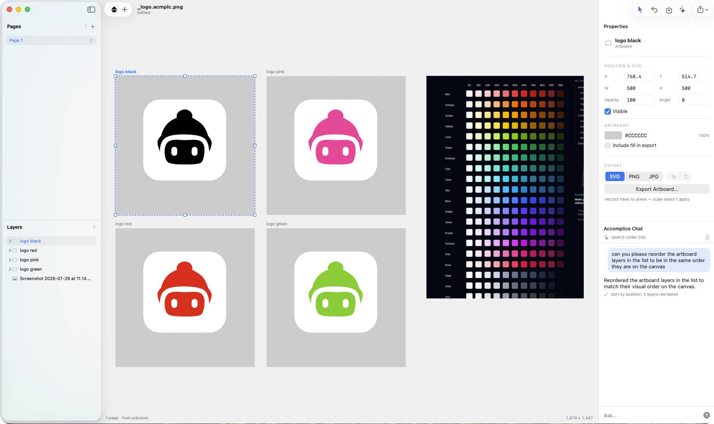

<p align="center">
  
</p>

<p align="center">
  Bitmap and vector, back together. A fast, local design tool for the Mac,<br>
  in the lineage of Fireworks and early Sketch.
</p>

<p align="center">
  <a href="https://accomplice.ai">accomplice.ai</a>&nbsp; • &nbsp;
  <a href="https://accomplice.ai/download">Download for Mac</a>&nbsp; • &nbsp;
  3 MB&nbsp; • &nbsp;macOS 14+&nbsp; • &nbsp;MIT
</p>

<p align="center">
  <a href="https://github.com/adamhowell/accomplice/actions/workflows/ci.yml"></a>
  <a href="Tests"></a>
  
  
  <a href="LICENSE"></a>
</p>

---

<p align="center">
  
</p>

## Why I built Accomplice

One evening I checked my oldest design files. 240 of the 393 `.sketch` files on my
machine no longer open, because the formats they were saved in have been abandoned.
The work didn't wear out. The software left.

It had happened to me before. I used Fireworks religiously until Adobe killed it in
2013, and nothing since has wanted to be what it was: one person, one file, pixels
and paths in the same canvas, assets out the door by lunch.

Accomplice is how I make sure neither eviction happens again. It's a 3 MB native Mac
app with no account, no subscription, and no telemetry. Every document is a PNG with
its own source riding inside, so even if this app disappears, `unzip` gets your
artwork back as plain SVG. The escape hatch is the file format.

## Quick start

Grab the [signed, notarized build](https://accomplice.ai/download), unzip, drop it
in Applications, open. Or build it yourself:

```bash
git clone https://github.com/adamhowell/accomplice.git
cd accomplice
./bin/build
open build/Build/Products/Release/Accomplice.app
```

## What it does

- **Pen tool with live booleans.** Subtract a shape and both parts stay editable.
  Double-click straight into a combined shape, even into the holes it cut.
- **Auto Shapes.** Stars and polygons remember their recipe. Change 7 points to 5
  and the shape re-draws.
- **Live text**, with every property editable, including text set on a circle.
- **Quick photo work.** Crop, brightness, contrast, saturation, marquee and brush
  erase. All of it is non-destructive, so the pixels underneath are never touched.
- **Reads your old `.sketch` files.** Verified pixel-for-pixel against Sketch's own
  render on a 62-file corpus.
- **Export that behaves.** SVG, PNG, JPG at 1x to 3x, straight from the inspector.
  The canvas and the exporter draw through the same code, so they always agree.

## AI that helps you work smarter

The built-in chat handles the busywork:

> rename these forty layers
> reorder the layer list to match the canvas
> make every black fill our brand blue
> swap the headline on all six artboards

It runs against a model on your own machine (Ollama works out of the box) or an API
key you own. It only acts when you ask, every change lands as one ordinary undo
step, and your files are never used to train anything.

## The format

An `.acmplc.png` is a PNG **and** a ZIP at the same time. This is the Fireworks
`.fw.png` trick, which nobody has shipped since 2013. Finder thumbnails it, Preview
opens it, and `unzip` produces every page as SVG, the document as readable JSON, and
the placed images. There is no step where you need this program to get your artwork
back. Details in [docs/format.md](docs/format.md).

## Design notes

Zero dependencies, because a tool whose job is outliving other software shouldn't
inherit anyone's supply chain. CoreGraphics does the hard math, since macOS ships
curve-preserving path booleans. One compositor feeds both the canvas and the
exporter. Text is always outlined, so an export never depends on the viewer having
your fonts. More in [docs/design-notes.md](docs/design-notes.md).

## License

[MIT](LICENSE). If this project ever stops, fork it. The build instructions above
are the whole ceremony.
